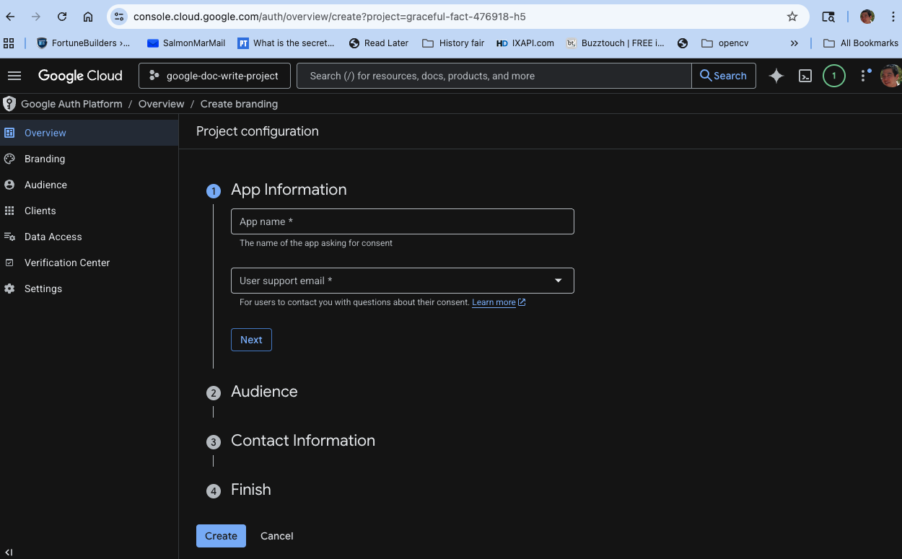
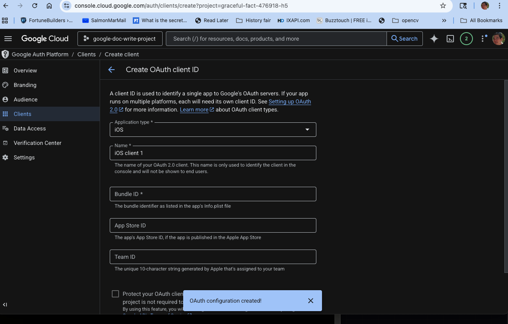
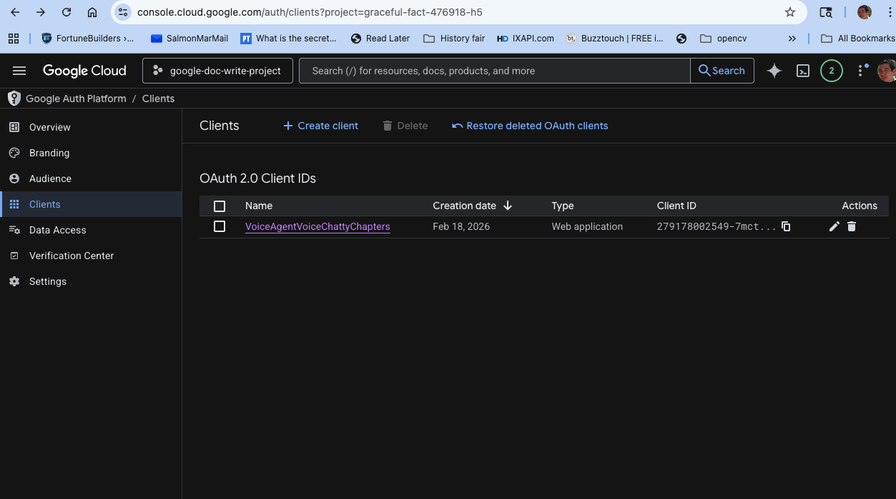

# Voice Agent + Finite State Machine Workflow Engine

Mac-hosted Python voice assistant that streams TTS audio to iPhone Safari via WebRTC, with a **hybrid FSM workflow engine** that decomposes complex queries into multi-step research pipelines.

Speak into your iPhone mic &rarr; Whisper STT &rarr; keyword router decides: **simple query** goes direct to LLM, **complex query** triggers a finite state machine &rarr; LLM reasons at each state &rarr; Piper TTS &rarr; hear response through iPhone speaker via WebRTC.

| Voice Agent | Connect | Workflow Debugger |
|:---:|:---:|:---:|
|  |  |  |

Works with **Ollama** (free, local), **Claude** (Anthropic API), or **OpenAI** &mdash; switchable at runtime from the mobile UI dropdown.

---

## The Finite State Machines

The workflow engine (`engine/workflow.py`) defines three FSM templates. A sub-millisecond regex keyword router inspects each user query and dispatches to the matching workflow &mdash; or falls through to a direct LLM call for simple queries.

Each state gets a **focused one-shot LLM prompt** (not the full conversation history), keeping reasoning isolated and token-efficient.

### 1. Research & Compare

Triggered by: *"compare"*, *"top 5"*, *"versus"*, *"market cap"*, *"which is better"*, *"pros and cons"*

```mermaid
stateDiagram-v2
    [*] --> initial_lookup: User asks comparison query
    initial_lookup --> decompose: Search results (ranking)
    decompose --> search_each: JSON array of per-entity queries
    search_each --> synthesize: All entity results collected
    synthesize --> [*]: Ranked answer spoken aloud

    state initial_lookup {
        direction LR
        note right of initial_lookup
            LLM generates search query
            with current year for freshness.
            Tool: web_search
        end note
    }

    state search_each {
        direction LR
        note right of search_each
            LOOP: one web_search per entity
            (rate-limited 1.5s between calls)
        end note
    }
```

**Example flow:** *"What are the top 5 S&P 500 companies by market cap?"*
1. **INITIAL_LOOKUP** &mdash; LLM crafts a search query &rarr; `web_search("top 5 S&P 500 companies market cap 2026")`
2. **DECOMPOSE** &mdash; LLM reads search results, emits JSON: `["Apple AAPL market cap 2026", "NVIDIA NVDA...", ...]`
3. **SEARCH_EACH** &mdash; Loop dispatches `web_search()` for each entity (with 1.5s rate-limit delay)
4. **SYNTHESIZE** &mdash; LLM reads all per-entity results, produces ranked conversational answer

### 2. Deep Research

Triggered by: *"tell me about"*, *"research"*, *"deep dive"*, *"comprehensive"*, *"what's happening with"*

```mermaid
stateDiagram-v2
    [*] --> initial_search: User asks research query
    initial_search --> evaluate_gaps: First search results
    evaluate_gaps --> targeted_search: 1-2 follow-up queries
    targeted_search --> synthesize: Gap-filling results
    synthesize --> [*]: Comprehensive answer

    state evaluate_gaps {
        direction LR
        note right of evaluate_gaps
            LLM identifies missing info
            and generates follow-up queries
        end note
    }

    state targeted_search {
        direction LR
        note right of targeted_search
            LOOP: web_search per gap query
        end note
    }
```

**Strategy:** Search once broadly, evaluate what's missing, search again to fill gaps, then synthesize.

### 3. Fact Check

Triggered by: *"is it true"*, *"fact check"*, *"verify"*, *"debunk"*

```mermaid
stateDiagram-v2
    [*] --> extract_claim: User asks fact-check question
    extract_claim --> search_evidence: Support query
    search_evidence --> search_counter: Counter query
    search_counter --> verdict: Both sides gathered
    verdict --> [*]: Verdict: true / false / partly true

    state extract_claim {
        direction LR
        note right of extract_claim
            LLM extracts the claim and
            generates both pro and con
            search queries
        end note
    }
```

**Strategy:** Extract the claim, search for evidence *supporting* it, search for evidence *against* it, then render a fair verdict citing specific sources.

---

## Architecture

```
┌─────────────────────────────────────────────────────────────┐
│  Mac Host                                                   │
│                                                             │
│  ┌─────────────────────┐   ┌──────────────────────────────┐ │
│  │     Engine           │   │         Gateway              │ │
│  │                      │   │                              │ │
│  │  WorkflowRunner      │   │  aiohttp server (:8080)      │ │
│  │  ├─ keyword router   │   │  ├─ GET / → index.html       │ │
│  │  ├─ FSM executor     │──▶│  ├─ GET /ws → WebSocket      │ │
│  │  └─ Orchestrator     │   │  │   signaling + agent loop   │ │
│  │     (fallthrough)    │   │  └─ RTCPeerConnection         │ │
│  │                      │   │     ├─ AudioTrack out (TTS)   │ │
│  │  Piper TTS (ONNX)   │──▶│     └─ AudioTrack in  (mic)   │ │
│  │  Whisper STT         │◀──│                               │ │
│  │  LLM (multi-provider)│   │                               │ │
│  └─────────────────────┘   └──────────────────────────────┘ │
└─────────────────────────┬───────────────────────────────────┘
                          │  WebRTC (UDP) via TURN relay
┌─────────────────────────▼───────────────────────────────────┐
│  iPhone Safari                                              │
│  ├─ Hold-to-talk walkie-talkie UI                           │
│  ├─ Workflow activity card (step progress, timer, debug)    │
│  ├─ Workflow debugger panel (FSM graph + code view)         │
│  └─ Model/voice switcher, web search toggle                 │
└─────────────────────────────────────────────────────────────┘
```

### How the router decides

```
User speaks → STT transcribes → keyword regex scan (<1ms)
                                      │
                        ┌─────────────┴─────────────┐
                        │                           │
                   Match found                 No match
                        │                           │
                  FSM workflow              Orchestrator.chat()
              (multi-step pipeline)        (single LLM call)
                        │                           │
                   Final answer ◄───────────────────┘
                        │
                  TTS → WebRTC → iPhone speaker
```

### Workflow UI on iPhone

When a workflow triggers, the mobile client shows:

- **Activity card** in the chat stream &mdash; segmented progress bar, step label, live timer, LLM diagnostics (model, tokens/sec, prompt size)
- **Debug panel** (slide-up overlay) &mdash; FSM node graph with active/visited highlighting, loop children with branch arms, plus a code view showing the prompt template for each state
- **Narration bubbles** &mdash; agent explains what it's doing at each step ("Searching for current ranking...", "Decomposing into individual lookups...")

---

## Quick Start

```bash
pip install -r requirements.txt
cp .env.example .env

# Add at least one LLM provider:
echo 'ANTHROPIC_API_KEY=sk-ant-...' >> .env   # Claude
# OR
echo 'OPENAI_API_KEY=sk-...' >> .env          # OpenAI
# OR just use Ollama (free, local):
brew install ollama && ollama pull llama3.2:3b

# Launch
bash scripts/run.sh     # Interactive launcher (recommended)
# OR
python3 -m gateway.server   # Direct server start
```

## Testing

```bash
python3 tests/test_suite.py          # Full suite (~30s)
python3 tests/test_suite.py --quick  # Unit tests only (~1s)
python3 scripts/smoke_test.py        # Headless TTS pipeline
```

## Project Structure

```
engine/
├── workflow.py          # FSM workflow engine (3 templates, keyword router)
├── orchestrator.py      # Unified chat loop (tool calling, hedging, callbacks)
├── llm.py               # Multi-provider LLM wrapper (Claude/OpenAI/Ollama)
├── tts.py               # Piper TTS (text → 48kHz PCM via ONNX)
├── stt.py               # Whisper STT (48kHz → 16kHz → text)
└── conversation.py      # Conversation history (10-turn window)

gateway/
├── server.py            # aiohttp HTTP/WS + workflow WebSocket protocol
├── webrtc.py            # RTCPeerConnection lifecycle, mic, TTS queue
├── turn.py              # Twilio TURN ephemeral credentials
└── audio/               # PCMRingBuffer, AudioQueue, WebRTCAudioSource

web/
├── index.html           # Two-screen mobile UI (connect → agent)
├── app.js               # WS signaling, WebRTC, workflow card, chat bubbles
├── styles.css           # Mobile-first dark theme with Art Deco styling
├── workflow-map.js      # FSM graph renderer (nodes, arrows, loop children)
└── workflow-code.js     # Code view renderer (prompt templates per state)

voice_assistant/         # Standalone CLI agent (shares engine/)
├── main.py              # CLI REPL entry point
├── config.py            # pydantic-settings
├── tools/               # Tool plugins (web_search, datetime, calendar, notes)
└── prompts/system.txt   # System prompt template

tests/
├── test_suite.py        # 90+ tests across 4 categories
├── test_mobile_ui.py    # Mobile UI integration tests
└── test_ui_workflow_v2.py  # Workflow debugger UI tests

scripts/
├── run.sh               # Unified launcher (local/LAN/cellular)
├── setup_tunnel.sh      # Cloudflare tunnel setup
├── test_cellular.sh     # iPhone cellular test script
└── smoke_test.py        # Headless pipeline test
```

## Key Technical Decisions

| Decision | Choice | Why |
|----------|--------|-----|
| Workflow routing | Precompiled regex keywords | Sub-millisecond, no LLM call needed for routing |
| Step prompts | One-shot (no conversation history) | Token-efficient, isolated reasoning per state |
| Loop rate-limiting | 1.5s between searches | Avoids 429 Too Many Requests from search APIs |
| Search result truncation | Snippets capped at 150 chars, total at 2.5K | Keeps decompose prompts small for faster LLM response |
| Thinking mode | Disabled for workflow steps | Focused prompts don't benefit from extended reasoning |
| TTS engine | Piper TTS (ONNX) | Fast offline neural TTS, no API keys |
| STT engine | faster-whisper (base, int8) | 4x faster than openai/whisper, CPU-only, ~75MB |
| Audio transport | WebRTC with Opus | 48kHz, NAT traversal via TURN, works over cellular |
| Mobile UX | Hold-to-talk walkie-talkie | Zero-delay touch events, works in Safari |

## Google Sign-In (Optional)

Google Sign-In enables per-user accounts, saved preferences, and conversation history tracking. Without it, the app falls back to the shared `AUTH_TOKEN` password.

### Setup

1. Go to [Google Cloud Console &rarr; Auth Platform](https://console.cloud.google.com/auth/overview)

2. **Create branding** &mdash; fill in App name and support email, then click Next through each step:

   

3. Go to **Clients** &rarr; **Create client**. Set **Application type** to **Web application** (not iOS):

   

4. Add **Authorized JavaScript origins**:
   - `http://localhost:8080` (local dev)
   - `https://your-domain.com` (production, if applicable)

5. Click Create. You'll see your clients listed with the Client ID:

   

6. Copy the **Client ID** (starts with numbers, ends with `.apps.googleusercontent.com`) &mdash; not the Client Secret.

7. Add to your `.env`:
   ```
   GOOGLE_CLIENT_ID=279178002549-xxxx.apps.googleusercontent.com
   ```

8. Restart the server. The login screen will now show a Google Sign-In button instead of the token input.

### Optional: Email Allowlist

Restrict access to specific Google accounts:
```
ALLOWED_EMAILS=alice@gmail.com,bob@company.com
```
Leave blank to allow any verified Google email.

### What it enables

- **User accounts** &mdash; name, email, avatar stored in SQLite
- **Saved preferences** &mdash; voice, model, and search settings persist across sessions
- **Session tokens** &mdash; 7-day browser sessions (no re-login on refresh)
- **Usage tracking** &mdash; conversation turns linked to user accounts

---

## Environment Variables

| Variable | Default | Description |
|----------|---------|-------------|
| `PORT` | `8080` | Server listen port |
| `AUTH_TOKEN` | `devtoken` | WebSocket auth token (legacy/dev mode) |
| `LLM_PROVIDER` | (auto) | `claude`, `openai`, or `ollama` |
| `ANTHROPIC_API_KEY` | &mdash; | Enables Claude |
| `OPENAI_API_KEY` | &mdash; | Enables OpenAI |
| `OLLAMA_MODEL` | `qwen3:4b` | Default Ollama model |
| `TWILIO_ACCOUNT_SID` | &mdash; | For TURN credentials |
| `TWILIO_AUTH_TOKEN` | &mdash; | For TURN credentials |
| `GOOGLE_CLIENT_ID` | &mdash; | Google OAuth Client ID (enables Google Sign-In) |
| `ALLOWED_EMAILS` | &mdash; | Comma-separated email allowlist (empty = allow all) |
| `TAVILY_API_KEY` | &mdash; | Web search provider (1K/month free) |
| `BRAVE_API_KEY` | &mdash; | Web search fallback (~1K/month free) |
| `SERPER_API_KEY` | &mdash; | Web search fallback (2.5K free) |

## Where We Are (Current State)

**What's working:**
- Full voice loop: iPhone mic &rarr; STT &rarr; LLM &rarr; TTS &rarr; WebRTC &rarr; iPhone speaker
- Three FSM workflow templates with live UI debugging (graph + code view + activity card)
- Multi-provider LLM support (Ollama/Claude/OpenAI) switchable from mobile UI
- Web search tool integration with DuckDuckGo
- Cloudflare tunnel for cellular access
- 90+ automated tests

**What's next:** See `docs/project-memory/backlog/` for tracked features and bugs.

---

*Built with Python (aiohttp, aiortc, Piper TTS, faster-whisper) and vanilla JS.*
