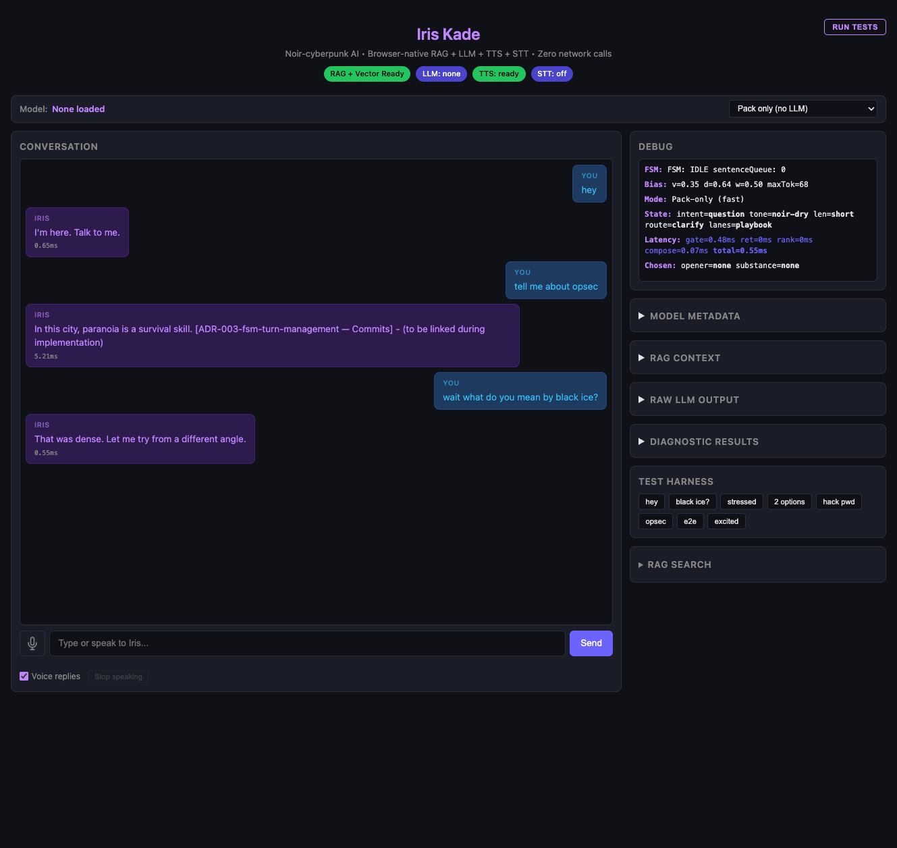

# Iris Kade

Noir-cyberpunk conversational AI — runs entirely in your browser. Zero network calls.



## What is this?

Iris Kade is a fully local conversational AI that runs 100% in the browser using WebGPU.
No API keys, no cloud services, no data leaves your machine. Talk to a noir-cyberpunk
security specialist who teaches defense — opsec, privacy, encryption, threat modeling.

## Features

- **Local LLM inference** via [web-llm](https://github.com/mlc-ai/web-llm) — 17+ models from 80MB to 5GB
- **Multi-lane RAG pipeline** — persona, playbook, knowledge, and lore retrieval with vector + lexical reranking
- **Streaming text-to-speech** — concurrent sentence generation + playback via [vits-web](https://github.com/niclas-niclasen/vits-web) (ONNX/WASM)
- **Speech-to-text** — Web Speech API for hands-free conversation
- **4-state conversation FSM** — IDLE → PROCESSING → SPEAKING → INTERRUPTED with clean abort handling
- **Adaptive conversation bias** — verbosity, depth, and warmth adjust to your communication style
- **Pack-only mode** — instant responses from the conversation pack without loading an LLM
- **Built-in diagnostic test harness** — one-click conversation testing with detailed per-turn analysis

## Architecture

```
┌─────────┐    ┌─────────┐    ┌──────────────┐    ┌──────────┐
│   STT   │───▶│   FSM   │───▶│   Pipeline   │───▶│   LLM    │
│ Web API │    │ 4-state │    │  StateGate   │    │ web-llm  │
└─────────┘    └────┬────┘    │  Retrieve    │    │ WebGPU   │
                    │         │  Rerank      │    └────┬─────┘
                    │         │  Compose     │         │
                    │         └──────────────┘         │
                    │                              ┌───▼────────┐
                    │                              │  Sentence   │
                    │                              │  Buffer     │
                    │                              └───┬────────┘
                    │         ┌──────────┐             │
                    └────────◀│  Speaker  │◀────────────┘
                              │ vits-web  │
                              │ TTS+Audio │
                              └──────────┘
```

The conversation FSM owns the turn lifecycle. User input (typed or spoken) triggers a transition from IDLE → PROCESSING. The multi-lane RAG pipeline composes context from persona, playbook, knowledge, and lore lanes. The LLM streams tokens through a sentence buffer, which feeds sentences to the TTS speaker for concurrent generation and playback. Interrupting resets everything cleanly.

## Quick Start

```bash
git clone https://github.com/<your-username>/speaker-generation-version-1.git
cd speaker-generation-version-1/web-app
npm install
npm run dev
```

Open [http://localhost:5173](http://localhost:5173) — select a model from the dropdown and start talking.

> **Requirements:** A browser with WebGPU support (Chrome 113+, Edge 113+). Larger models need more VRAM.

## Supported Models

| Model | Size | VRAM | Tags |
|-------|------|------|------|
| SmolLM2 135M | ~80MB | 0.3 GB | fast, mobile |
| SmolLM2 360M | ~200MB | 0.5 GB | fast, mobile |
| Qwen3 0.6B | ~400MB | 0.6 GB | fast, mobile, reasoning |
| Llama 3.2 1B | ~600MB | 0.8 GB | fast, balanced |
| Qwen2.5 1.5B | ~900MB | 1.0 GB | balanced |
| Qwen3 1.7B | ~1GB | 1.2 GB | balanced, reasoning |
| SmolLM2 1.7B | ~1GB | 1.2 GB | balanced |
| Gemma 2 2B | ~1.2GB | 1.4 GB | balanced |
| Llama 3.2 3B | ~1.8GB | 2.0 GB | balanced, smart |
| Phi 3.5 Mini | ~2.2GB | 2.5 GB | smart, balanced |
| Qwen3 4B | ~2.5GB | 2.8 GB | smart, reasoning |
| Qwen2.5 7B | ~4.5GB | 4.5 GB | smart |
| Qwen3 8B | ~5GB | 5.0 GB | smart, reasoning |
| Llama 3.1 8B | ~5GB | 5.0 GB | smart |
| DeepSeek R1 7B | ~4.5GB | 4.5 GB | reasoning, smart |
| Qwen2.5 Coder 1.5B | ~900MB | 1.0 GB | code, balanced |
| Qwen2.5 Coder 7B | ~4.5GB | 4.5 GB | code, smart |

Or use **Pack-only mode** for instant responses without downloading any model.

## Screenshots

| Initial UI | Diagnostic Complete | Opsec Response |
|:---:|:---:|:---:|
|  |  |  |

| History View | Turn Detail | Token Cap |
|:---:|:---:|:---:|
|  |  |  |

## Roadmap

See the [backlog](docs/project-memory/backlog/README.md) for tracked features:

- [F-001: Phone remote client](docs/project-memory/backlog/F-001-phone-remote-client.md) — WebSocket thin client for mobile
- [F-002: Fast-think / slow-think](docs/project-memory/backlog/F-002-fast-slow-think.md) — dual-LLM architecture for instant + deep responses

## Tech Stack

- **Build:** [Vite](https://vitejs.dev/) + TypeScript (vanilla, no framework)
- **LLM:** [@mlc-ai/web-llm](https://github.com/mlc-ai/web-llm) (WebGPU inference)
- **Embeddings:** [@huggingface/transformers](https://huggingface.co/docs/transformers.js) with `Xenova/all-MiniLM-L6-v2` (384-dim, WebGPU/WASM)
- **TTS:** [@diffusionstudio/vits-web](https://github.com/niclas-niclasen/vits-web) (ONNX/WASM)
- **STT:** Web Speech API
- **Tests:** [Playwright](https://playwright.dev/) E2E

## License

MIT
